# Библиотека передача данных по радио-каналу для CodeVisionAVR

Вашему вниманию предлагается **три версии** библиотеки для модулей передатчика **«FS1000A»** и приёмника **«MX-RM-5V»** и им подобным.

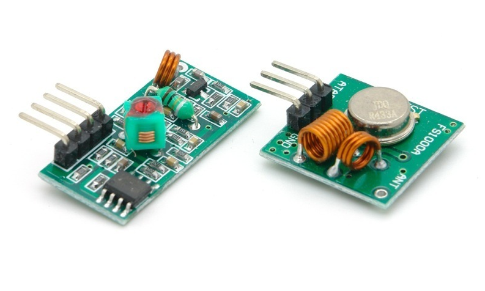

Все версии библиотеки применяют **«манчестерское кодирование»**:  
* Выходной бит данных 1 --- передаётся как сначала 1 потом 0  
* Выходной бит данных 0 --- передаётся как сначала 0 потом 1
### Состав пакета:
* **«Стартовый бит»** (1 период логической 1-ницы)
* **«Преамбула»** 1 Байт = (0b01010101)
* **Пользовательские данные** (n Байт)
* **«CRC»** 1 Байт
* 
Все биты пакета передаются начиная со стартового бита и далее все остальные байты начиная с нулевого бита каждого байта последовательно.

Вы можете например распределить первый байт пользовательских данных для служебной информации о пакете и использовать «TimeOut-ы»:
* **«id» передатчика** (n бит)  
1 --- Передатчик № 1  
2 --- Передатчик № 2
* **«id» приёмника** (n бит)  
0 --- Для всех приёмников  
1 --- Приёмник № 1
* **«id» пакета** (n бит)  
0 --- Все данные вмещаются в один пакет  
1 --- Пакет № 1
* **Актуальность пакета** (1 бит)  
0 --- Новый пакет  
1 --- Повтор пакета

____
## Подключение библиотеки

Для подключения библиотеки к вашему созданному проекту выберите нужную версию и скопируйте файлы **«RadioPeredacha.c»** и **«RadioPeredacha.h»** для передачи данных и **«RadioPriem.c»** и **«RadioPriem.h»** для приёма данных по радио-каналу в папку с вашим проектом. Далее подключите файл **«RadioPeredacha.c»** для передачи данных и **«RadioPriem.c»** для приёма данных по радио-каналу к вашему проекту в CodeVisionAVR нажав в **меню** ==> **«Project»**, ==> **«Configure»**, во вкладке **«Files»** нажмите кнопку **«Add»** и выберите в папке с вашим проектом эти файлы. Затем в вашем файле **«.c»** где объявлена функция **«main»** добавьте в нужном месте строку (**#include <RadioPeredacha.h>**) для передачи и (**#include <RadioPriem.h>**) для приёма данных по радио-каналу.
После этого нужно настроить файл **«RadioPeredacha.h»** для передачи и **«RadioPriem.h»** для приёма данных по радио-каналу. О том как это сделать написано в этих файлах. Теперь вы можете вызывать функции библиотеки.

___
## Версия v1 «Стробирование»

Входной сигнал на любую ножку микроконтроллера AVR. Функция **«RadioPriem»** стробирует входной радио-сигнал и должна вызываться с периодичностью в 8 раз меньше чем период следования одного бита передатчика. Фиксирует все 1-ные логические уровни и использует их в своих расчётах.

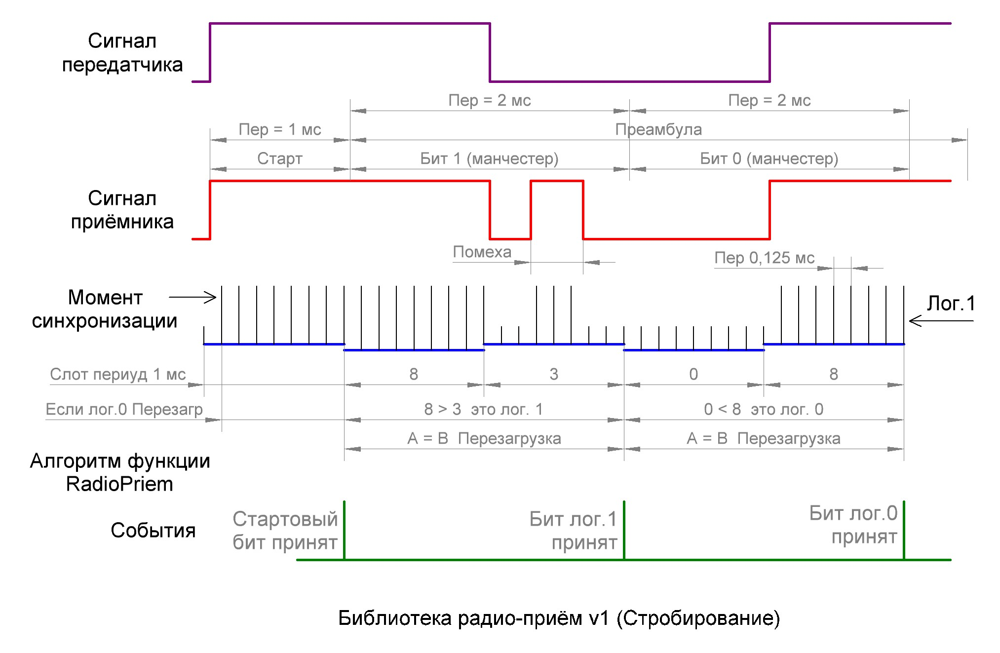

Для тестирования этой версии библиотеки соберите на монтажной плате схему представленную ниже

В папке **«Тест»** находится пример проекта а также прошивка и установка (Fuse Bits) для микроконтроллера. Потребление памяти после компиляции этого проекта для передатчика и приёмника представлены ниже.

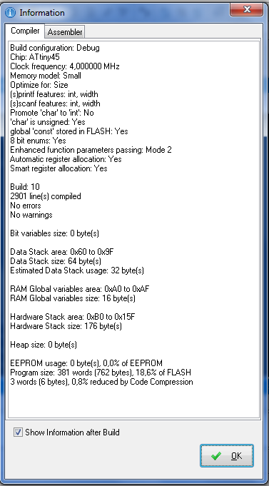

___
## Версия v2 «INT0 + INT1»

Входной сигнал на две ножки микроконтроллера AVR **«INT0»** и **«INT1»**. Для **«INT0»** необходимо настроить прерывание по нарастающему фронту а для **«INT1»** по спадающему фронту. Два отдельных таймера/счётчика. Оба этих таймера/счётчика используются в монопольном режиме. В процессе работы функция **«RadioPriem»** изменяет их период работы. Для одного из них необходимо настроить прерывание в котором будет вызываться функция **«RadioPriem»**. Этот таймер/счётчик выполняет функцию внутреннего тактового сигнала. Второй используется как таймер для измерения периода каждого входного радио-сигнала.

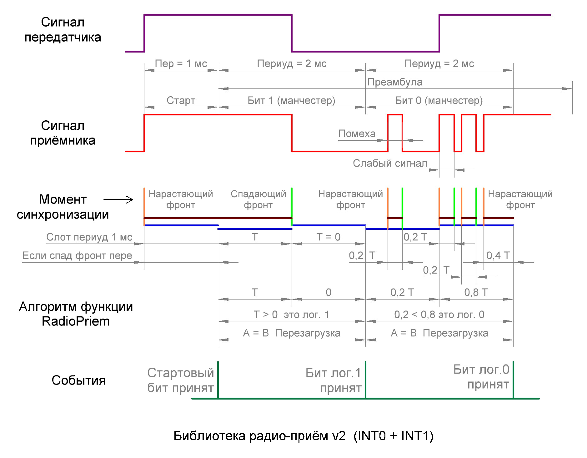

Для тестирования этой версии библиотеки соберите на монтажной плате схему представленную ниже

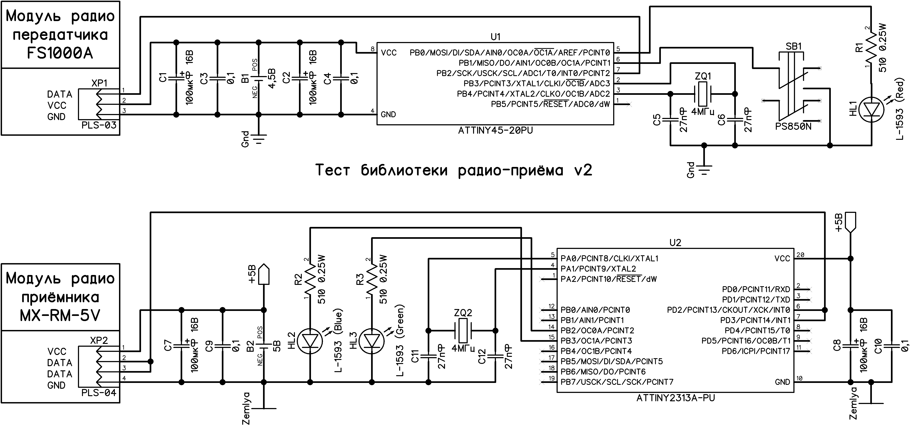

В папке **«Тест»** находится пример проекта а также прошивка и установка (Fuse Bits) для микроконтроллера. Потребление памяти после компиляции этого проекта для передатчика и приёмника представлены ниже.

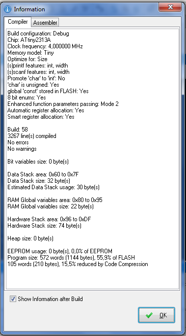

___
## Версия v3 «АЦП»

Входной сигнал на любой вывод **«ADC»** микроконтроллера AVR. Требуется 1 АЦП (аналого-цифровой преобразователь), который будет работать в монопольном режиме. Для него необходимо настроить прерывание в котором будет вызываться функция **«RadioPriem»**. Это прерывание стабильно срабатывает после каждых 13-ти тактов тактовой частоты модуля АЦП и используется в качестве внутреннего тактового сигнала при радио-приёме. Так как АЦП в микроконтроллерах AVR для точного измерения умеет делать максимум 15 000 измерений в секунду, то по этому доступна только одна скорость передачи данных по радио-каналу равная (приблизительно период 1-во бита = 1 миллисекунда (1000 бит/сек)). И эта 1 миллисекунда будет оцифрована максимум (15 000 / (в одной секунде 1000 миллисекунд)) 15 раз.

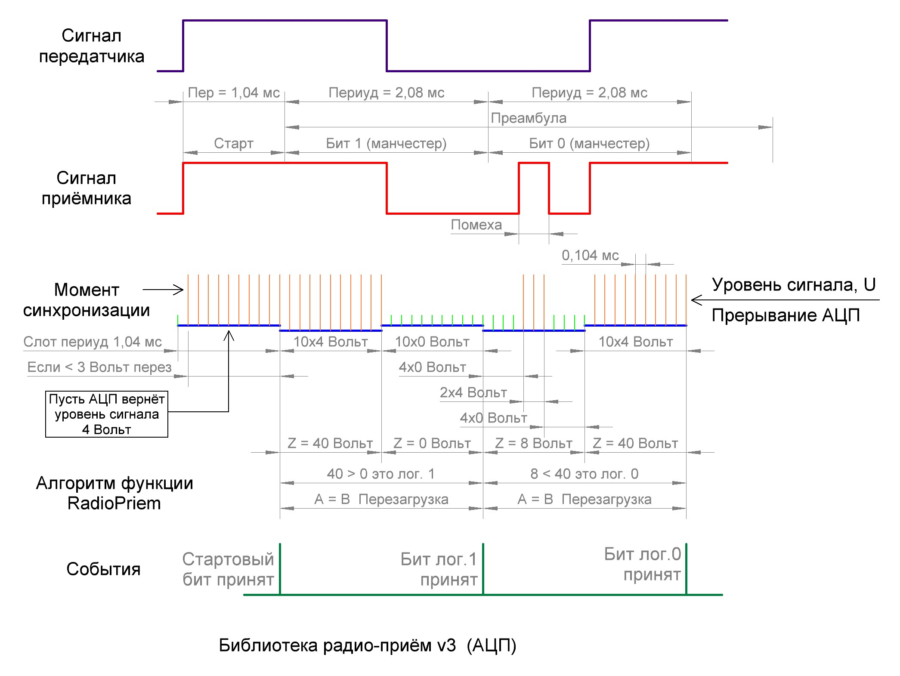

Для тестирования этой версии библиотеки соберите на монтажной плате схему представленную ниже

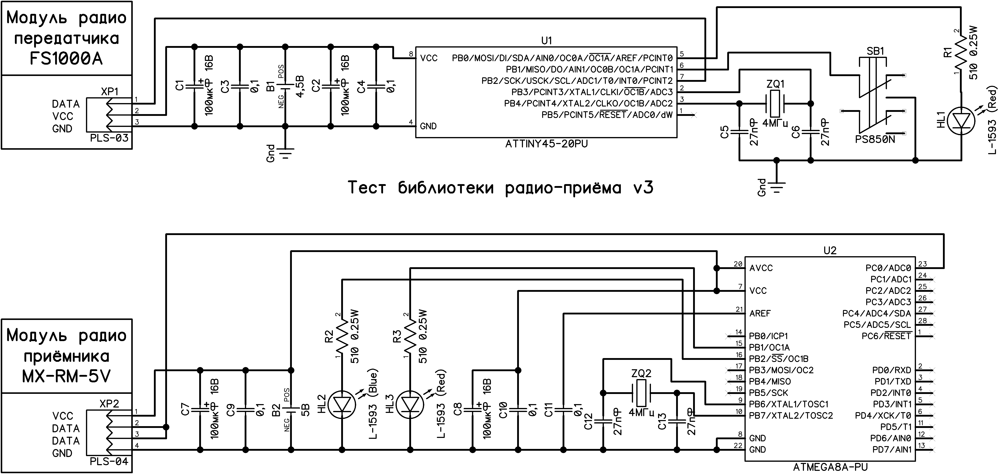

В папке **«Тест»** находится пример проекта а также прошивка и установка (Fuse Bits) для микроконтроллера. Потребление памяти после компиляции этого проекта для передатчика и приёмника представлены ниже.

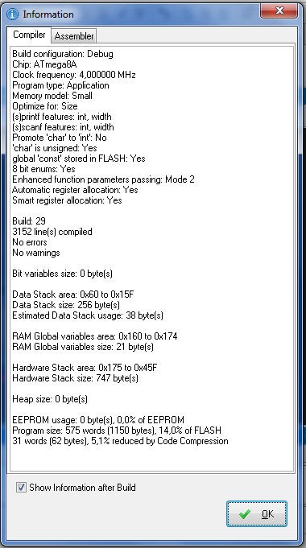

___
## Тестирование

Результаты тестирования всех трёх библиотек представлены ниже. Тестирование проводилось вручную путём нажатия на кнопку на плате передатчика и визуального наблюдения загоревшегося светодиода на плате приёмника. Всего было передано 100 пакетов по 5 пользовательских байт для каждого режима. Пустая ячейка в таблице означает что тестирование в этом режиме не проводилось.

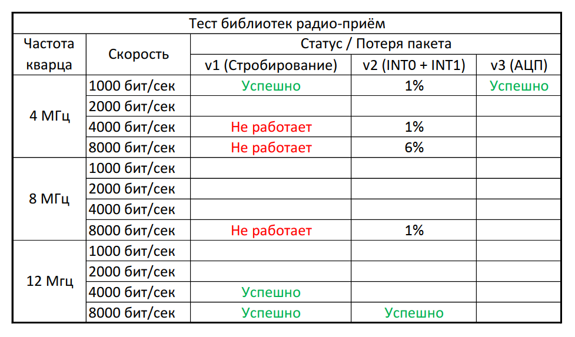

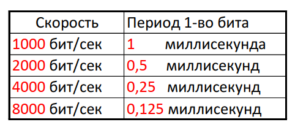

Все три версии этих библиотек находятся в папке **«Радио-данные»**.
